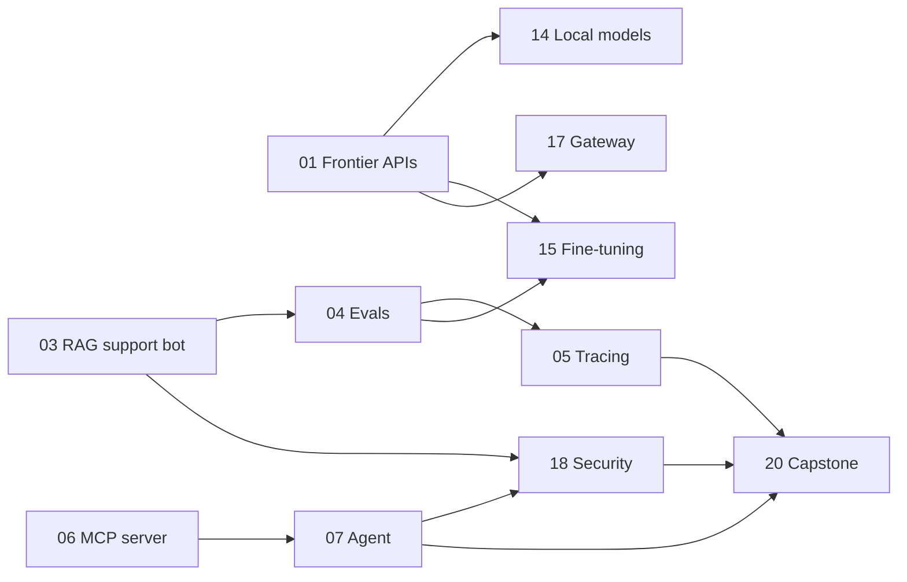

# AI Builds

Twenty small, working builds. One current AI technology each, two hours each, one every two days.

I've spent 20 years leading e-commerce product and technology. This repo is how I keep my hands on the AI stack: pick a technology, ship something small with it against a realistic online-store problem, and write down what it's good for, what it costs and where it breaks.

**The rules**

- Two-hour timebox per build: about 20 minutes of docs, 75 of building, 25 of write-up.
- Every build works on the same fictional online store (catalog, orders, support email, policies), so later builds reuse earlier ones.
- Most of the code is written with Claude Code, an AI coding agent. The write-ups and conclusions are mine.
- Every folder's README leads with the result, then covers what I built, what surprised me, what it cost, and when I would and wouldn't use it in production.

## Tracker

`Planned` → `In progress` → `Shipped` (with the date and a link to the write-up post)

### Foundations

The building blocks: model APIs, context, retrieval, and knowing whether any of it works.

| # | Target | Build | Status |
|---|---|---|---|
| 01 | Sep 21 | **[Frontier APIs side by side](01-frontier-apis/)**<br>Same 10 messy customer emails to Claude, GPT and Gemini with one JSON schema; compare accuracy, latency, cost. | Planned |
| 02 | Sep 23 | **[Context engineering: caching, long context, reasoning budgets](02-context-engineering/)**<br>Whole policy handbook and catalog in the prompt; 10 questions with caching on/off and reasoning low/high. | Planned |
| 03 | Sep 25 | **[RAG support bot with pgvector](03-rag-pgvector/)**<br>Support bot over the store's help center and catalog that cites its sources; then add a reranker. | Planned |
| 04 | Sep 27 | **[Evals for the support bot](04-evals/)**<br>20 test cases for the 03 bot with LLM-as-judge scoring, run against two models; find a regression. | Planned |
| 05 | Sep 29 | **[Tracing and cost visibility](05-tracing/)**<br>Instrument the bot with Langfuse; inspect cost and latency per request; turn bad answers into eval cases. | Planned |

### Agents

Tools, protocols and agent loops, including the agents that now write the code.

| # | Target | Build | Status |
|---|---|---|---|
| 06 | Oct 1 | **[MCP server for store operations](06-mcp-server/)**<br>Expose search_products, get_order_status and create_return over MCP; drive them in plain English. | Planned |
| 07 | Oct 3 | **[Customer-service agent with an approval gate](07-agent-sdk/)**<br>Agent handles order-status and return conversations using the 06 server, with human approval before any return. | Planned |
| 08 | Oct 5 | **[Agent Skills, subagents and hooks](08-agent-skills/)**<br>Package a repeatable procedure as a SKILL.md, add a subagent and a git-status hook; test portability in a second tool. | Planned |
| 09 | Oct 7 | **[Async cloud coding agents, head to head](09-cloud-coding-agents/)**<br>One well-specified GitHub issue assigned to two cloud coding agents; compare the pull requests. | Planned |
| 10 | Oct 9 | **[Browser agent for competitive price monitoring](10-browser-agents/)**<br>Agent visits five public product pages and extracts price, shipping and return window; measure failure rate and cost. | Planned |

### Modalities and models

Voice, documents, images and video, plus running and tuning models myself.

| # | Target | Build | Status |
|---|---|---|---|
| 11 | Oct 11 | **[Voice agent: where is my order?](11-voice-agent/)**<br>A phone number that takes an order number, looks it up and reads back the status; measure latency and cost per call. | Planned |
| 12 | Oct 13 | **[Document AI: supplier invoices to JSON](12-document-ai/)**<br>Five synthetic supplier invoices to validated JSON; measure field-level accuracy and cost per page. | Planned |
| 13 | Oct 15 | **[Product imagery and a short video](13-image-video-gen/)**<br>A consistent four-image product set plus an 8-second clip using reference images; track cost per usable asset. | Planned |
| 14 | Oct 17 | **[Local and open-weight models](14-local-models/)**<br>Re-run the 01 benchmark on a local open-weight model; write down when local actually wins. | Planned |
| 15 | Oct 19 | **[Fine-tune a small model (QLoRA)](15-fine-tuning/)**<br>Fine-tune a small open model on ~200 labeled support emails; score it against a prompted frontier model. | Planned |

### Production and leadership

What it takes to run this in a real business: cost, security, commerce protocols, orchestration.

| # | Target | Build | Status |
|---|---|---|---|
| 16 | Oct 21 | **[Low-code agent workflow](16-low-code-agents/)**<br>n8n flow: inbox trigger, classify and draft, human approval, send and log. Find where no-code stops being enough. | Planned |
| 17 | Oct 23 | **[Gateway, fallbacks and cost control](17-llm-gateway/)**<br>Route the 01 benchmark through a gateway with a fallback model and spend cap; cost per 1,000 requests by model. | Planned |
| 18 | Oct 25 | **[Prompt injection: break it, then fix it](18-ai-security/)**<br>Hide an instruction in a product review the bot reads; show the exploit, add defenses, re-test with a red-team run. | Planned |
| 19 | Oct 27 | **[Agentic commerce: UCP, ACP, AP2](19-agentic-commerce/)**<br>An agent searches a catalog and builds a cart over UCP; plus a one-page point of view for a mid-market merchant. | Planned |
| 20 | Oct 29 | **[Capstone: multi-agent customer operations](20-multi-agent-capstone/)**<br>Supervisor plus two specialists, approval on refunds, state in Postgres, traced and gated by the earlier evals. | Planned |

**On the bench:** agent memory, AI governance (EU AI Act, NIST AI RMF), AI app builders, spec-driven development, text-to-SQL agents.

## How the builds connect

The order is deliberate. A few small systems get reused and hardened instead of starting from zero every time, and the capstone puts them together.



## Stack

TypeScript and Node where possible, Python where the ecosystem lives there. Postgres (Neon) with pgvector. Models from Anthropic, OpenAI and Google, plus open-weight models run locally. All data is synthetic; see [`data/`](data/).

## Repo layout

```
01-frontier-apis/ … 20-multi-agent-capstone/   one self-contained build per folder
data/                                           shared synthetic store data
_template/                                      README template for new builds
CLAUDE.md                                       working rules for the coding agent
```

## About

Tom Halpin. Product and technology leader, e-commerce.
[LinkedIn](https://www.linkedin.com/in/tom-halpin-2a357ba/) · [tomhalpin.com](https://tomhalpin.com)

MIT licensed. Use anything here.
